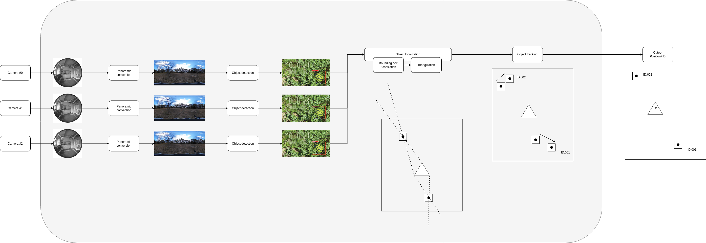

# Beholder

## Arch

## Taks
- [ ] Panoramic warp
- [ ] Obejct detection
  - [ ] Training of the robot like objects
  - [ ] Running inference on jetson nano or OAK-D camera
- [ ] BB assosiation across triplet of images
- [ ] Object tracking
